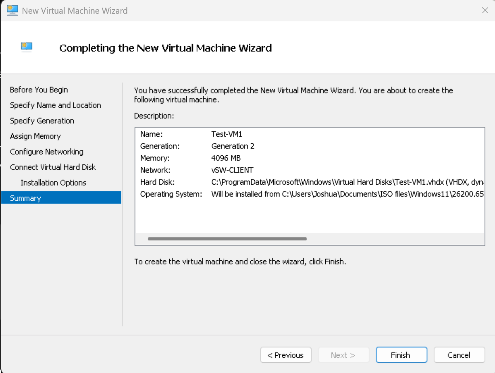
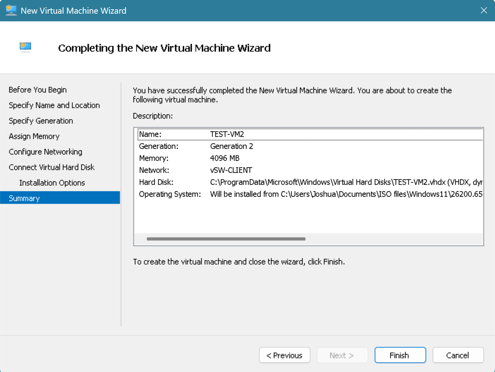
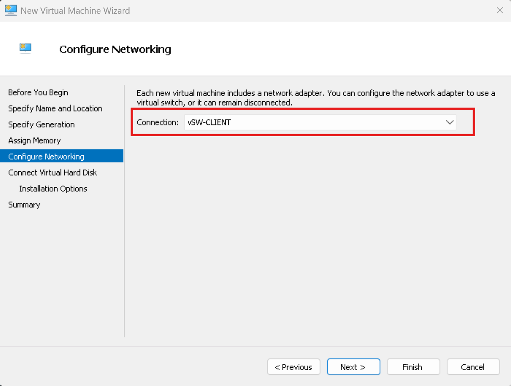
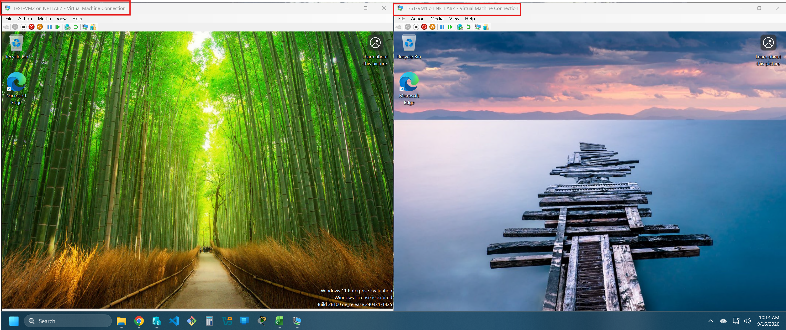
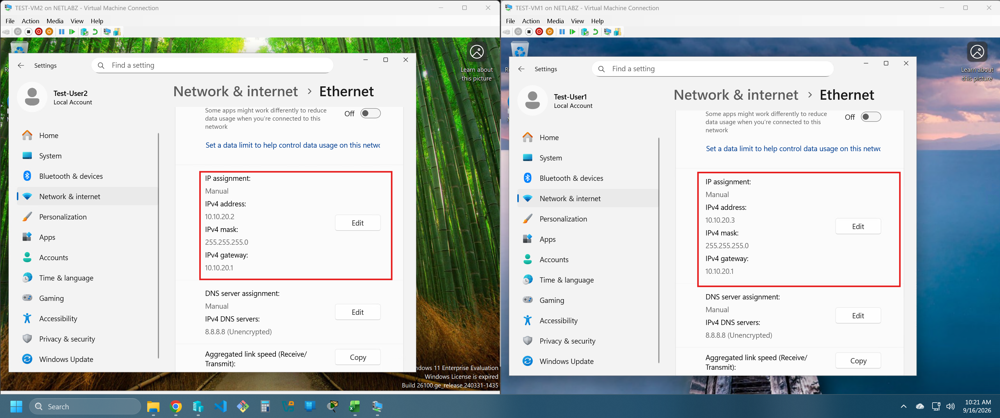
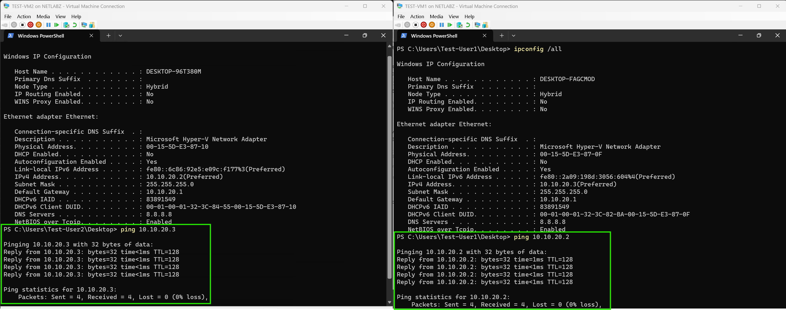
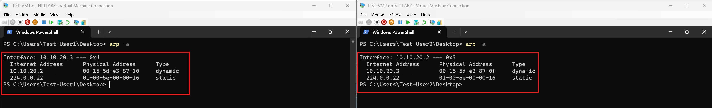

# Phase 1 — Virtual Switching and Isolated Test Network

In this phase, I set up the Hyper-V virtual switches and used two temporary Windows 11 VMs to test communication on the client network. I assigned static IPv4 addresses, checked connectivity in both directions, and inspected the ARP entries each VM learned. This gives me a working starting point for the firewall and routing work in later phases.

## Virtual switches

Hyper-V currently shows the following project switches:

| Switch | Type / connection | Planned use |
| --- | --- | --- |
| `vSW-EXT` | External, bound to the Realtek physical NIC | Connection toward the physical network |
| `vSW-SERVER` | Internal | Server-side lab network |
| `vSW-CLIENT` | Internal | Client-side lab network and the Phase 1 test |
| `vSW-DMZ` | Internal | Future DMZ network |

The two test VMs were connected to `vSW-CLIENT`. An **internal** switch permits communication between connected VMs and the Hyper-V host's virtual adapter; it does not by itself provide a route to the home network. The external switch is separate from this test.

## Building the test VMs

I created `TEST-VM1` and `TEST-VM2` as Generation 2 virtual machines with 4096 MB of startup memory each. Both were attached to `vSW-CLIENT` and installed from a Windows 11 ISO. These are temporary machines for testing the virtual network, not the project's final client and server VMs.

## Addressing and connectivity

I set both VMs to manual IPv4 addresses on `10.10.20.0/24`:

| VM | IPv4 address | Subnet mask | Configured gateway | Configured DNS |
| --- | --- | --- | --- | --- |
| `TEST-VM1` | `10.10.20.3` | `255.255.255.0` | `10.10.20.1` | `8.8.8.8` |
| `TEST-VM2` | `10.10.20.2` | `255.255.255.0` | `10.10.20.1` | `8.8.8.8` |

> Note: `.2` and `.3` fall inside the "network infrastructure" range in my addressing plan, not the `.200–.239` range I set aside for lab/testing. Since these are throwaway VMs, I should have used `.200`/`.201` instead — will follow the convention correctly going forward.

The gateway and DNS entries were configured on the VMs, but these screenshots do not verify that either service is reachable. The two VMs communicate directly on the same subnet, so the successful pings do not depend on a gateway or DNS server.

`TEST-VM1` pinged `10.10.20.2`, and `TEST-VM2` pinged `10.10.20.3`. Each direction received four replies with **0% packet loss**. I then ran `arp -a` on both machines: VM1 had a dynamic entry for `10.10.20.2`, and VM2 had a dynamic entry for `10.10.20.3`. This shows that each VM resolved its neighbor's IPv4 address to a MAC address during the local-network test.

## Where Phase 1 leaves things

The two test VMs can talk to each other on `vSW-CLIENT`, and the pings and ARP entries confirm the basic network works — once I fix the addressing to match my own plan. Since I would need to download wireshark onto my VM in order to capture the traffic for that VM I will move that test to another phase, as well as the subnet troubleshooting since there isn't a router configured yet.
