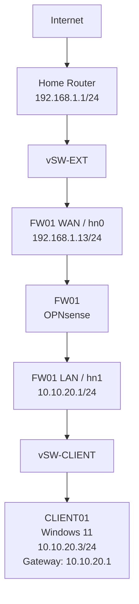

# Phase 2 — Firewall / Router VM

In this phase, I started building the network edge for my NetLabz environment using OPNsense. I created a `FW01` virtual machine, connected it to both the external and client-side virtual switches, assigned the WAN and LAN interfaces, and configured the client network gateway at `10.10.20.1/24`. I then verified that `CLIENT01` could reach the firewall and opened the OPNsense web interface. The remaining work is to complete the installation to the virtual disk, verify outbound NAT and internet access, isolate the lab from the home network, and test a firewall rule failure.

## Firewall platform

I decided to go with **OPNsense Community Edition** for `FW01`. It'll act as the firewall and router between the isolated NetLabz networks and my existing home network. I chose OPNsense because it gives me one platform for practicing routing, NAT, firewall rules, logging, VPNs, and IDS/IPS as the project expands.

For the initial Phase 2 setup, I am only using two interfaces:

| OPNsense interface | Hyper-V switch | Purpose |
| --- | --- | --- |
| `WAN` | `vSW-EXT` | Upstream connection to the existing home network |
| `LAN` | `vSW-CLIENT` | Gateway for the NetLabz client network |

Additional server, DMZ, and management interfaces will be added in later phases when they're needed.

## Building FW01

I created `FW01` as a Generation 2 virtual machine and attached the OPNsense 26.7 DVD ISO. I kept the VM fairly small because as I mentioned, the Hyper-V host currently has 16 GB of RAM and I want to leave enough resources available for the rest of the lab.

| Setting | Configuration |
| --- | --- |
| VM name | `FW01` |
| Generation | Gen 2 |
| Virtual processors | 2 |
| Memory | 3072 MB fixed |
| Virtual disk | 16 GB dynamically expanding VHDX |
| Network adapters | 2 |
| Installation media | OPNsense 26.7 DVD AMD64 ISO |

After creating the VM, I added two virtual network adapters. One is connected to `vSW-EXT` and the other to `vSW-CLIENT`.

I booted the VM from the OPNsense ISO and reached the OPNsense console successfully.

## Interface assignment and addressing

I had to match the Hyper-V adapters to the OPNsense interfaces by MAC address to ensure I was configuring the correct adapter.

| Hyper-V switch | MAC address | OPNsense interface | Role |
| --- | --- | --- | --- |
| `vSW-EXT` | `00-15-5D-E3-87-11` | `hn0` | WAN |
| `vSW-CLIENT` | `00-15-5D-E3-87-12` | `hn1` | LAN |

I did not configure LAGGs, VLANs, or optional interfaces during this phase. Those features are outside the scope of what I wanted to do, maybe in time I'll come across the topic again and add.

The WAN interface received `192.168.1.13/24` from the existing home network through DHCP. OPNsense initially used `192.168.1.1/24` on the LAN side, which would have placed both interfaces on the same subnet. I changed the LAN interface to the planned NetLabz client gateway, `10.10.20.1/24`.

The resulting interface configuration is:

| Device / interface | IPv4 address | Network | Purpose |
| --- | --- | --- | --- |
| Home router | `192.168.1.1/24` | `192.168.1.0/24` | Existing upstream gateway |
| `FW01` WAN | `192.168.1.13/24` | `192.168.1.0/24` | Connection to the home network |
| `FW01` LAN | `10.10.20.1/24` | `10.10.20.0/24` | NetLabz client gateway |
| `CLIENT01` | `10.10.20.3/24` | `10.10.20.0/24` | Windows 11 lab client |

The current path through the lab is:

## Gateway connectivity

`CLIENT01` is the only Windows client currently being used in the lab. I removed the second temporary Phase 1 client (CLIENT02) to conserve host resources and storage.

From `CLIENT01`, I verified connectivity to the firewall by pinging `10.10.20.1`. The gateway replied successfully with **0% packet loss**, and the ARP table showed a dynamic entry for the firewall interface.

I then opened `https://10.10.20.1` in Microsoft Edge from `CLIENT01`. The browser displayed a certificate warning because the OPNsense web interface is using its local certificate, but the warning itself confirmed that the client was reaching the firewall over HTTPS.

After continuing to the site, I reached the OPNsense web interface and initial configuration wizard.

## Where Phase 2 leaves things

`FW01` is up and routing between `vSW-EXT` and `vSW-CLIENT`, `CLIENT01` can reach the firewall's LAN gateway and pull up the OPNsense web GUI, and matching the Hyper-V adapters to OPNsense interfaces by MAC address kept the WAN/LAN assignment predictable instead of guessing. The catch is that OPNsense is still reporting **live media mode** — the VM is still booted from the ISO, so this whole configuration disappears on the next reboot. Before touching NAT or firewall policy, the next step is finishing the install to the `FW01` virtual disk and confirming the WAN/LAN setup survives a reboot. After that, Phase 2 still needs outbound NAT so `CLIENT01` can actually reach the internet, rules that stop the lab from reaching into the home network, an internet/DNS/isolation test, and one intentionally broken rule to troubleshoot with the logs. Reaching the gateway and web GUI only proves local LAN connectivity — NAT and isolation are still unverified.