# Phase 2 — Firewall / Router VM

In this phase, I built the network edge for my NetLabz environment using OPNsense. I created `FW01` for my firewall VM, connected it to the external and Internal-Client Hyper-V switches, assigned WAN and LAN interfaces, and configured `10.10.20.1/24` as the gateway for the client network. I then installed OPNsense to the virtual disk, verified the configuration survived a reboot, and configured the WAN side so `CLIENT01` could route through the firewall to the internet.

The remaining work is to isolate the lab from the home network, validate the firewall rules and DNS behavior, intentionally create and repair a firewall rule failure, and finish the Phase 2 documentation.

## Firewall platform

I decided to go with **OPNsense Community Edition** for `FW01`. It'll act as the firewall and router between the isolated NetLabz networks and my existing home network. I chose OPNsense because it gives me one platform for practicing routing, NAT, firewall rules, logging, VPNs, and IDS/IPS as the project expands.

For the initial Phase 2 setup, I am only using two interfaces:

| OPNsense interface | Hyper-V switch | Purpose |
| --- | --- | --- |
| `WAN` | `vSW-EXT` | Upstream connection to the existing home network |
| `LAN` | `vSW-CLIENT` | Gateway for the NetLabz client network |

Additional server, DMZ, and management interfaces will be added in later phases when they're needed.

## Building FW01

I created `FW01` as a Generation 2 virtual machine and attached the OPNsense 26.7 DVD ISO. I kept the VM fairly small because as I mentioned, the Hyper-V host currently has 16 GB of RAM and I want to leave enough resources available for the rest of the lab.

| Setting | Configuration |
| --- | --- |
| VM name | `FW01` |
| Generation | Gen 2 |
| Virtual processors | 2 |
| Memory | 3072 MB fixed |
| Virtual disk | 16 GB dynamically expanding VHDX |
| Network adapters | 2 |
| Installation media | OPNsense 26.7 DVD AMD64 ISO |

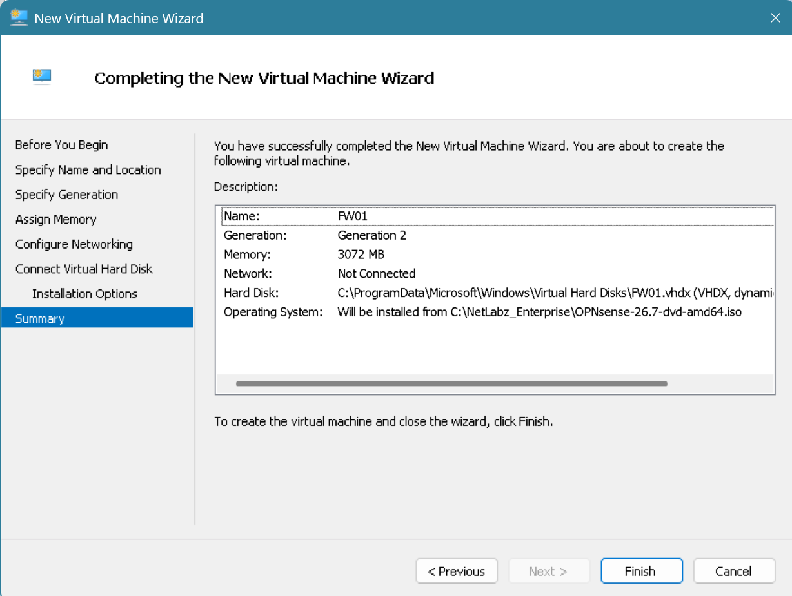

After creating the VM, I added two virtual network adapters. One is connected to `vSW-EXT` and the other to `vSW-CLIENT`.

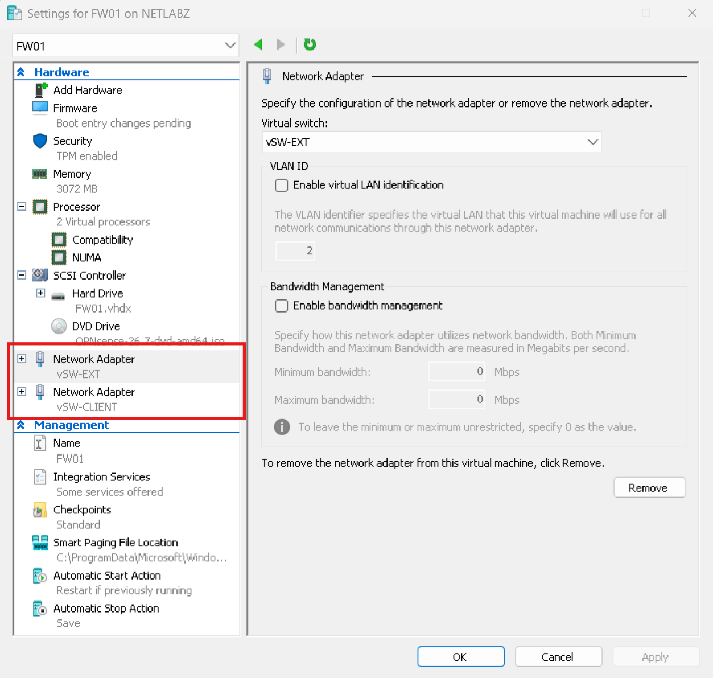

I booted the VM from the OPNsense ISO and reached the OPNsense console successfully.

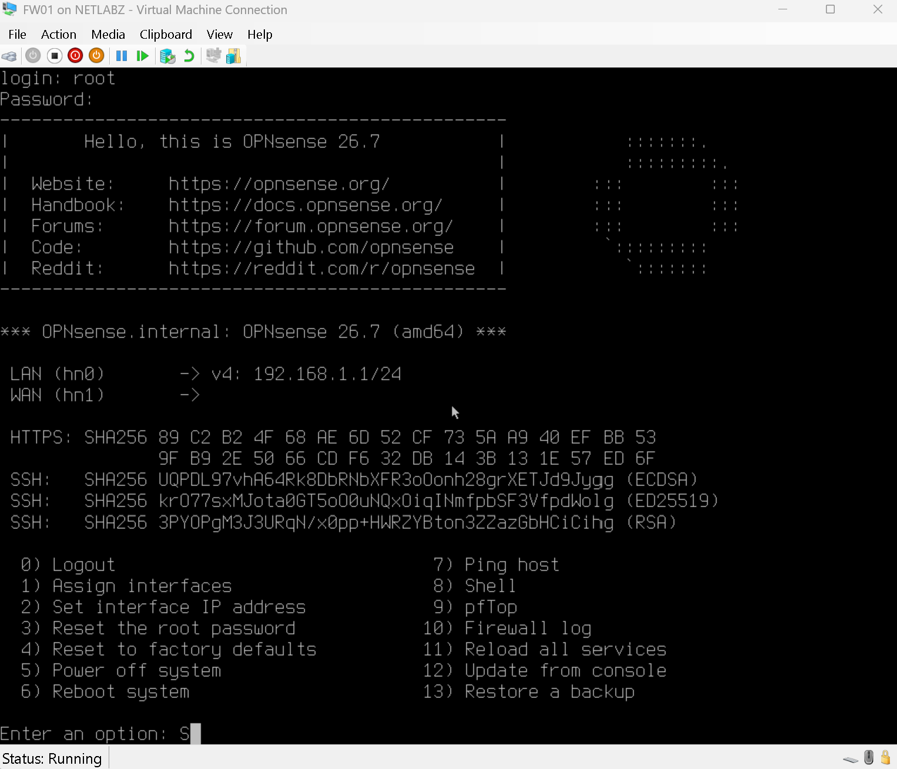

## Interface assignment and addressing

I had to match the Hyper-V adapters to the OPNsense interfaces by MAC address to ensure I was configuring the correct adapter.

| Hyper-V switch | MAC address | OPNsense interface | Role |
| --- | --- | --- | --- |
| `vSW-EXT` | `00-15-5D-E3-87-11` | `hn0` | WAN |
| `vSW-CLIENT` | `00-15-5D-E3-87-12` | `hn1` | LAN |

I did not configure LAGGs, VLANs, or optional interfaces during this phase. Those features are outside the scope of what I wanted to do, maybe in time I'll come across the topic again and add.

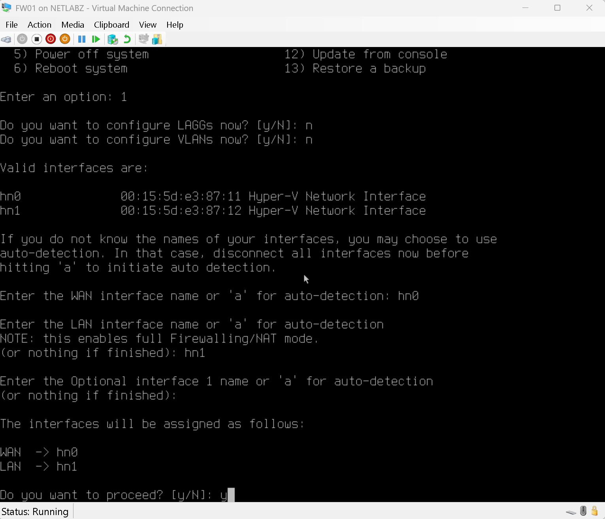

The WAN interface was initially configured as `192.168.1.13/24`, while the LAN interface initially used OPNsense's default `192.168.1.1/24`. This placed both interfaces on the same `192.168.1.0/24` network, so I changed the LAN interface to the planned NetLabz client gateway, `10.10.20.1/24`.

During later connectivity testing, I also found that the WAN interface had been configured statically without an upstream gateway. I corrected the WAN configuration to use DHCP so the existing home router could provide both the WAN addressing information and the default gateway.

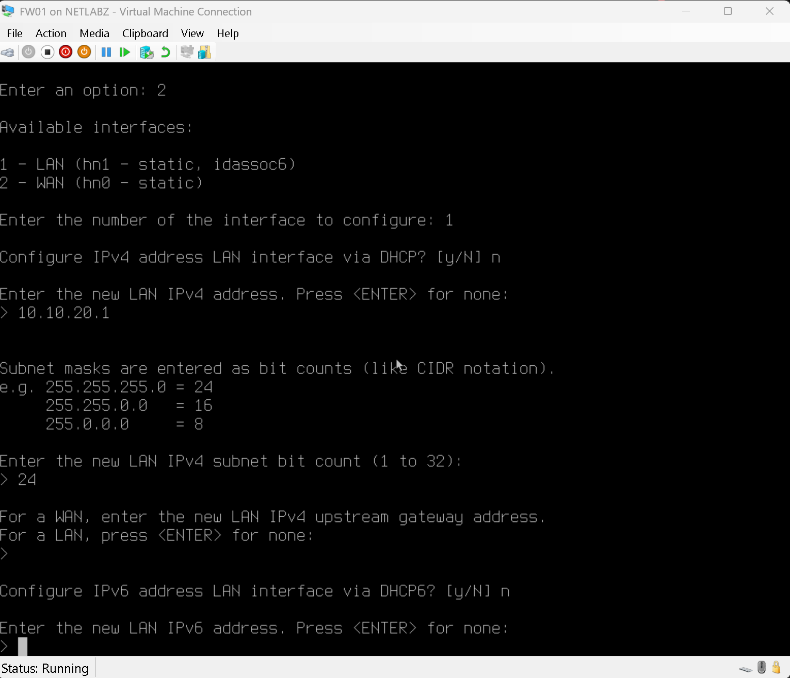

The resulting interface configuration is:

| Device / interface | IPv4 address | Network | Purpose |
| --- | --- | --- | --- |
| Home router | `192.168.1.1/24` | `192.168.1.0/24` | Existing upstream gateway |
| `FW01` WAN | DHCP (`192.168.1.13/24` during testing) | `192.168.1.0/24` | Connection to the home network |
| `FW01` LAN | `10.10.20.1/24` | `10.10.20.0/24` | NetLabz client gateway |
| `CLIENT01` | `10.10.20.3/24` | `10.10.20.0/24` | Windows 11 lab client |

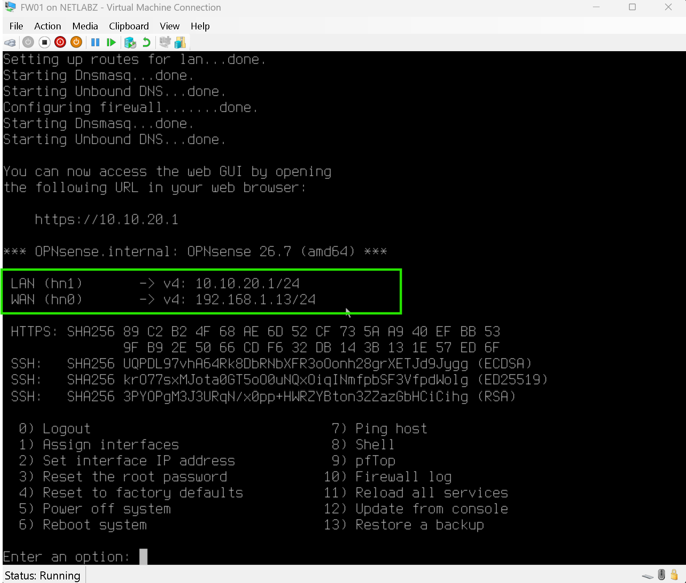

The current path through the lab is:

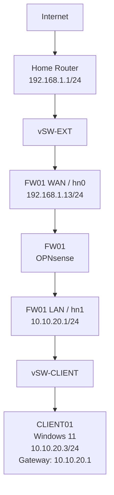

## Gateway connectivity

`CLIENT01` is the only Windows client currently being used in the lab. I removed the second temporary Phase 1 client (CLIENT02) to conserve host resources and storage.

From `CLIENT01`, I verified connectivity to the firewall by pinging `10.10.20.1`. The gateway replied successfully with **0% packet loss**, and the ARP table showed a dynamic entry for the firewall interface.

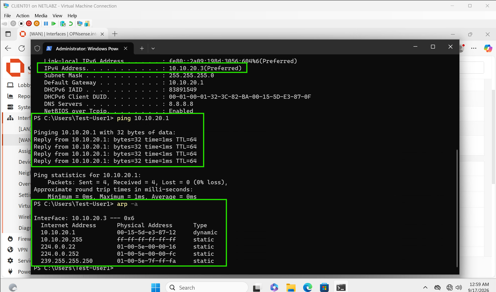

I then opened `https://10.10.20.1` in Microsoft Edge from `CLIENT01`. The browser displayed a certificate warning because the OPNsense web interface is using its local certificate, but the warning itself confirmed that the client was reaching the firewall over HTTPS.

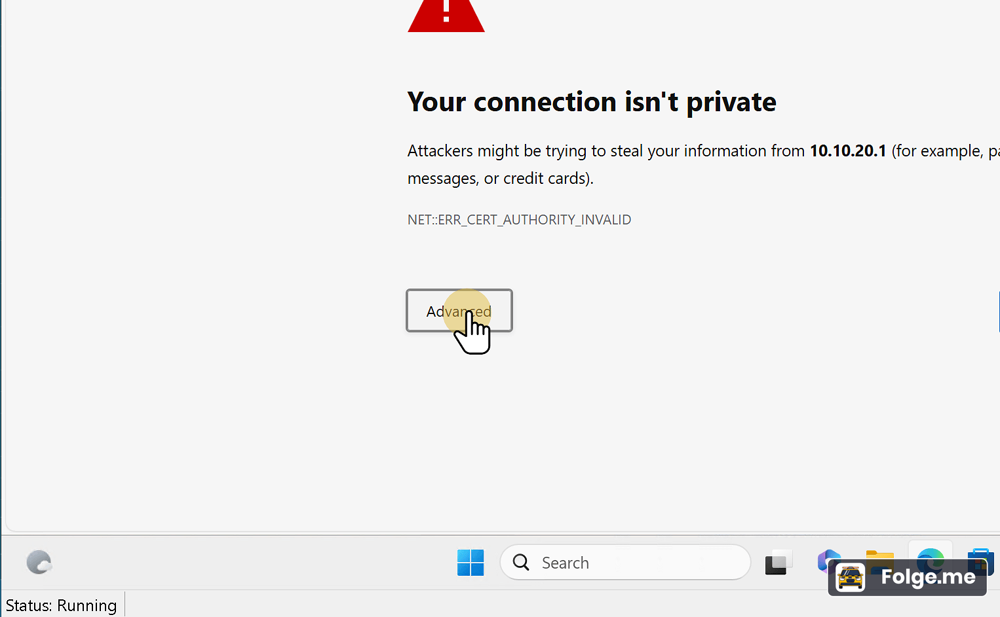

After continuing to the site, I reached the OPNsense web interface and initial configuration wizard.

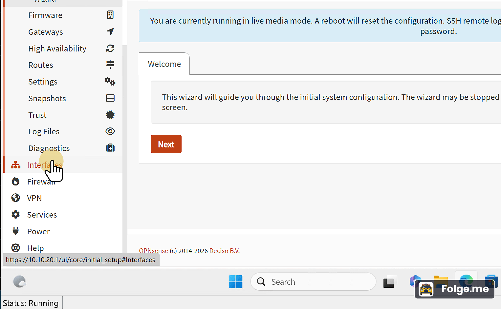

## Routing / Internet Access

After confirming that `CLIENT01` could reach the firewall, I tested connectivity beyond the LAN interface.

The first test failed. `CLIENT01` could successfully ping `10.10.20.1`, but attempts to reach the home router at `192.168.1.1` or an internet address such as `8.8.8.8` failed. A traceroute stopped at `10.10.20.1`, with FW01 reporting that the destination was unreachable.

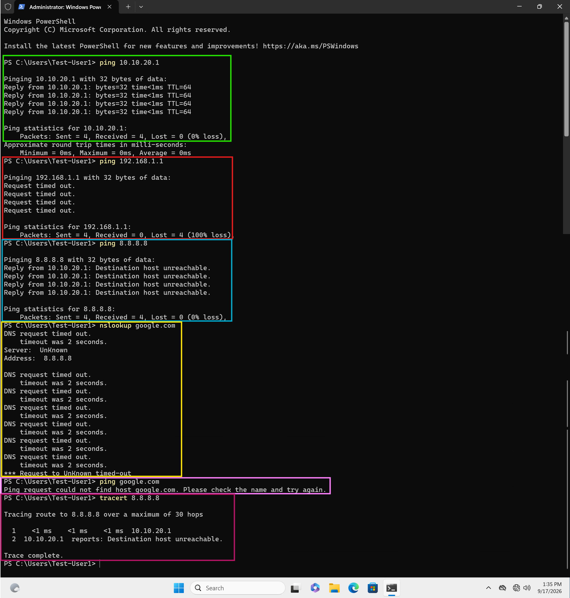

The issue was traced to the WAN configuration. `FW01` had a static WAN address configured but no upstream default gateway. Because the firewall didn't have a usable default route, it had no path for traffic destined outside its directly connected networks.

I changed the WAN interface to DHCP via the web browser GUI on CLIENT01. The home router then supplied the WAN configuration and upstream gateway automatically.

I documented the troubleshooting process separately in [INC005](../../Incidents/INC005-OPNsense-Default-Gateway.md).

After correcting the WAN configuration, I repeated the tests from `CLIENT01`:

- `ping 10.10.20.1` — successful
- `ping 192.168.1.1` — successful
- `ping 8.8.8.8` — successful
- `nslookup google.com` — successful
- `ping google.com` — successful
- `tracert 8.8.8.8` — successful

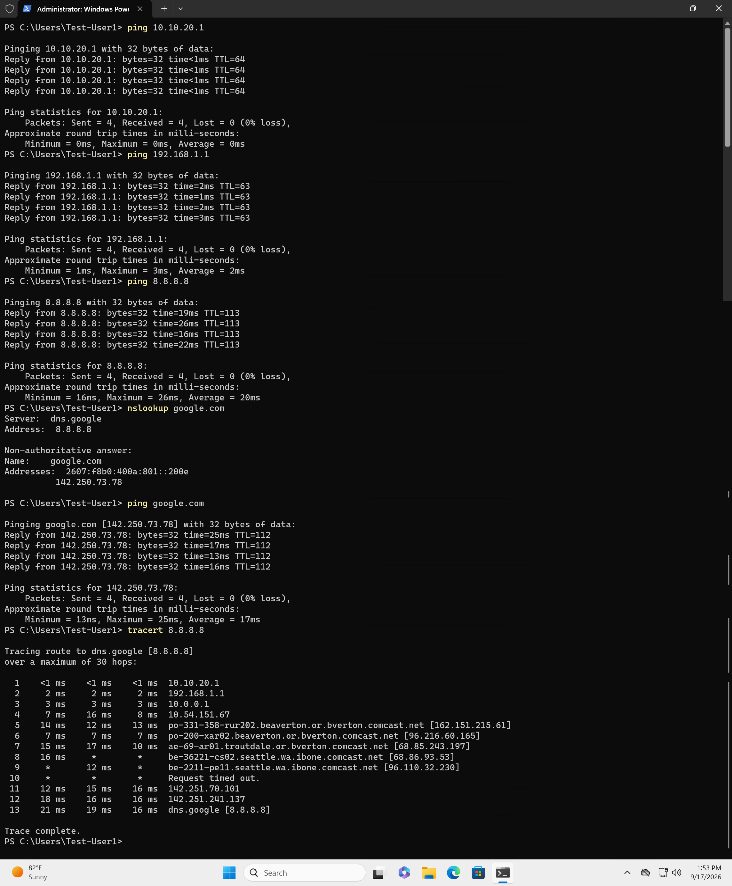

The traceroute showed the expected path beginning with FW01 at `10.10.20.1`, followed by the home router at `192.168.1.1`, before continuing through the ISP network.

At this point, CLIENT01 had working internet access through OPNsense instead of being directly connected to the home network.

## Installing OPNsense to the virtual disk

The first OPNsense boot was running from the installation ISO in live media mode. This allowed me to configure and test the firewall, but those changes would not survive a reboot.

I completed the OPNsense installation to the `FW01` virtual VHDX, disconnected the installation ISO, and rebooted the VM from the virtual disk. After rebooting, the WAN and LAN configuration remained intact and the live media warning was no longer displayed.

This confirmed that the firewall configuration was now persistent before I continued with routing and NAT testing.

## Where Phase 2 leaves things

`FW01` is now installed to its virtual disk and operating as the gateway between the NetLabz client network and the existing home network. `CLIENT01` can reach the firewall at `10.10.20.1`, access the OPNsense web interface, resolve DNS names, and reach the internet through FW01.

Testing also exposed a WAN routing problem caused by configuring the WAN interface with a static address but no upstream gateway. Changing the WAN interface to DHCP restored the default route and allowed traffic to leave the lab successfully. I documented that failure separately as an incident because it was a useful example of the difference between having an IP address and having a working route outside the local network.

The remaining Phase 2 work is to prevent the NetLabz client network from initiating connections into the protected home network while still allowing internet access, verify the resulting firewall behavior and logs, intentionally create and repair one firewall rule failure, and commit the final Phase 2 documentation.