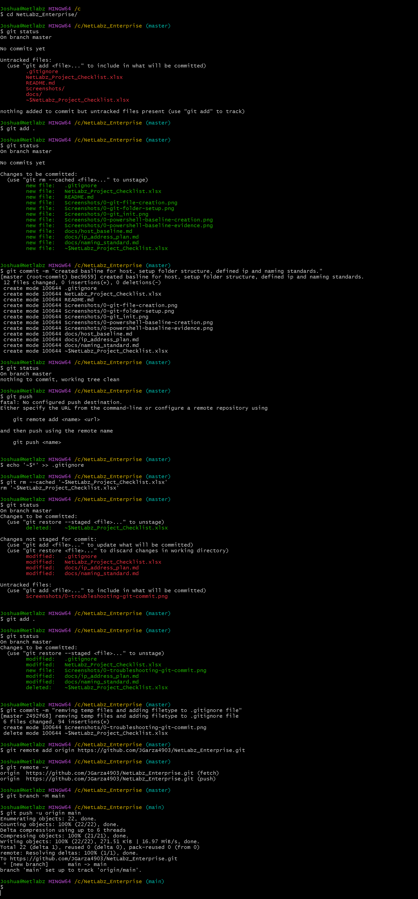

# INC001 - Git Remote Not Configured / Temporary File Committed

Date: 2026-09-15

Area: Project Setup / Git

While creating the initial Git history for the NetLabz Enterprise project, I ran into two issues:

1. My local Git repository was not connected to my GitHub repository.
2. An Excel temporary file was accidentally included in my initial commit because the spreadsheet was open.

The temporary file was:

`~$NetLabz_Project_Checklist.xlsx`

## What Happened

I started by checking the repository:

```bash
git status
```

The project had no commits yet and all files were untracked.

I staged the project files:

```bash
git add .
```

Then verified them with:

```bash
git status
```

At this point, I did not notice that the Excel temporary file was included with the files being staged.

I created the initial commit:

```bash
git commit -m "created baseline for host, setup folder structure, defined ip and naming standards."
```

The commit completed successfully, and `git status` showed a clean working tree.

When I attempted:

```bash
git push
```

Git returned:

```text
fatal: No configured push destination.
```

This showed that Git was working locally, but the repository had not yet been connected to GitHub.

## Removing the Temporary Excel File

Before pushing the project to GitHub, I added an ignore rule for Microsoft Office temporary files:

```bash
echo '~$*' >> .gitignore
```

Because the temporary Excel file had already been committed, adding it to `.gitignore` by itself did not remove it from Git tracking.

I removed the file from Git's tracked files with:

```bash
git rm --cached '~$NetLabz_Project_Checklist.xlsx'
```

I checked the repository again:

```bash
git status
```

Git showed the temporary file as deleted from tracking and also showed the other project files I had modified since the first commit.

I staged the updated project:

```bash
git add .
```

Then committed the cleanup:

```bash
git commit -m "removing temp files and adding filetype to .gitignore file"
```

This removed the temporary Excel file from the repository while keeping the ignore rule in place so similar files will not be tracked in future commits.

## Connecting the Repository to GitHub

I added the GitHub repository as the remote named `origin`:

```bash
git remote add origin https://github.com/JGarza4903/NetLabz_Enterprise.git
```

I verified the remote configuration:

```bash
git remote -v
```

This confirmed that both fetch and push were pointing to the correct GitHub repository.

I then renamed the local branch from `master` to `main`:

```bash
git branch -M main
```

Finally, I pushed the local repository to GitHub:

```bash
git push -u origin main
```

The push completed successfully and Git reported:

```text
[new branch] main -> main
branch 'main' set up to track 'origin/main'
```

The `-u` option established `origin/main` as the upstream branch, so future updates can be sent with:

```bash
git push
```

## What I Learned

Git and GitHub are separate. I had successfully initialized the repository and created commits with Git, but those commits only existed locally until I configured a remote and pushed them to GitHub.

I also learned that `.gitignore` prevents matching files from being tracked in the future, but it does not automatically remove a file that has already been committed. In that situation, `git rm --cached` can be used to remove the file from Git tracking without deleting the local file.

## Evidence

The command history below shows the initial commit, failed push, temporary file cleanup, remote configuration, and successful push.

