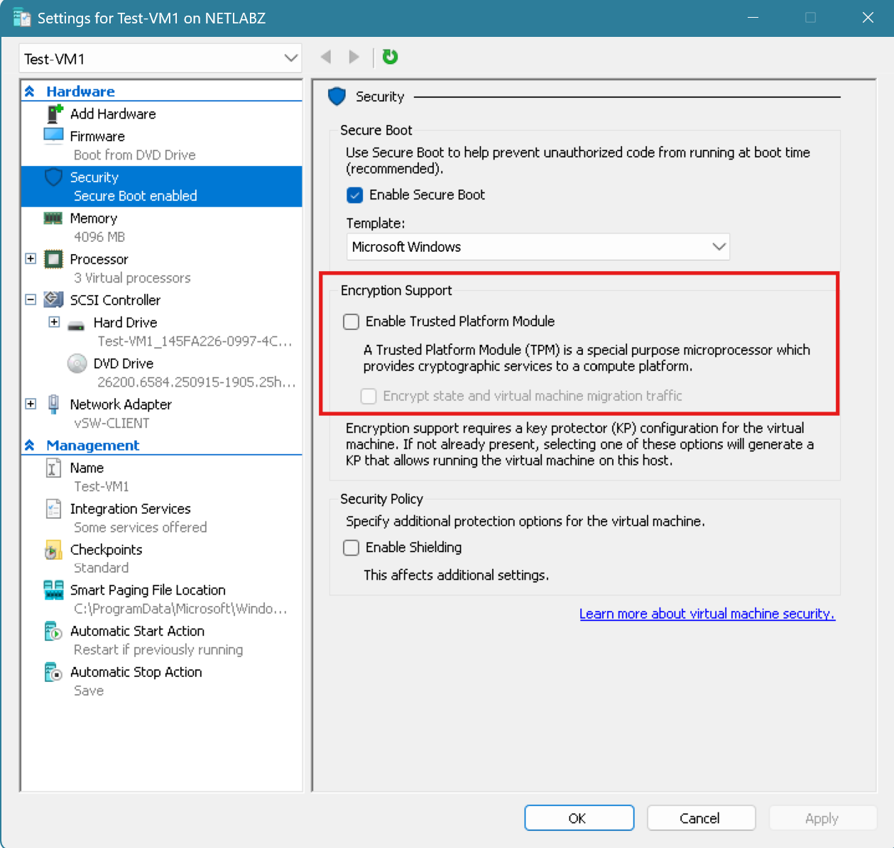
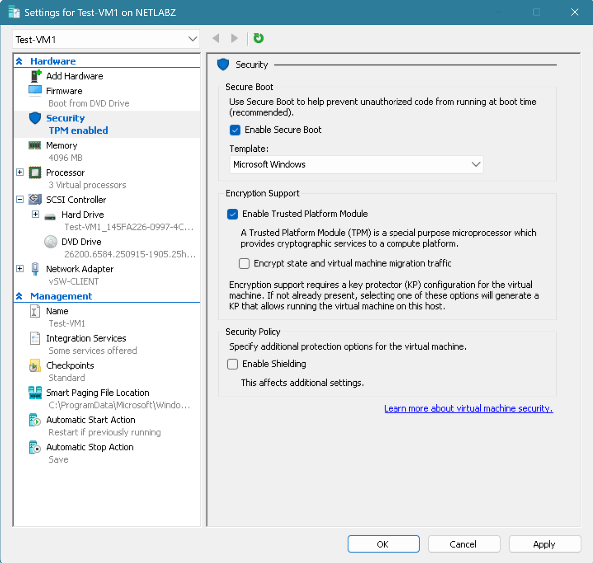
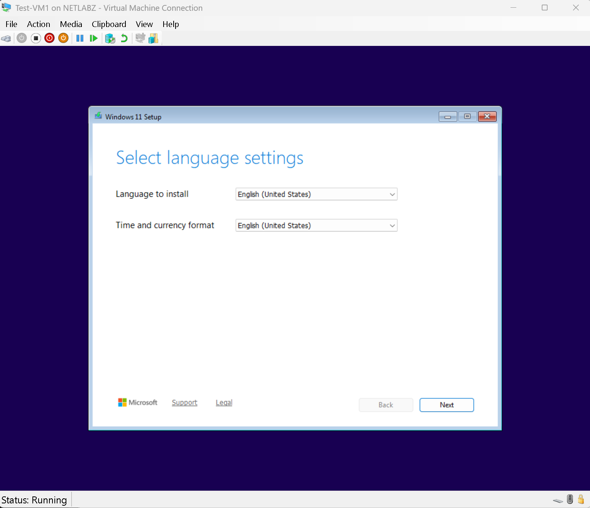

# INC002 - Windows 11 Installation Blocked by TPM 2.0 Requirement

Date: 2026-09-16

Area: Hyper-V / Windows 11 VM Deployment

## What Happened

While installing Windows 11 on `Test-VM1`, Windows Setup stopped the installation and reported that the PC did not meet the system requirements because TPM 2.0 was not available.

The VM was already configured as a Generation 2 virtual machine with Secure Boot enabled, so I checked the Hyper-V security settings to verify whether the virtual Trusted Platform Module was enabled.

## Root Cause

In the VM's **Settings > Security** page, **Enable Trusted Platform Module** was unchecked, therefore Windows couldn't detect a TPM 2.0 device and blocked the installation.

## Resolution

I had to shut down the VM, open **Right Click Test-VM1 > Settings > Security**, and enabled **Trusted Platform Module** while leaving Secure Boot enabled with the Microsoft Windows template. I'm fairly certain this is something that can only be done after creating the VM and before installing OS. I do not recall seeing this option when creating.

After applying the setting, the VM showed **TPM enabled** and Windows 11 Setup was able to detect the required virtual TPM.

## What I Learned

Windows 11 requirements still apply to virtual machines. A Generation 2 Hyper-V VM can provide the required TPM functionality through a virtual TPM, but it must be explicitly enabled in the VM's security settings.

This also reinforced the importance of checking the VM configuration before assuming an installation problem is being caused by the ISO or host hardware.

## Evidence

Windows Setup error showing the TPM 2.0 requirement:

