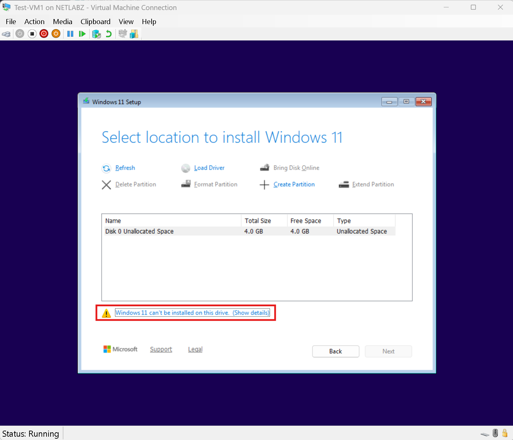
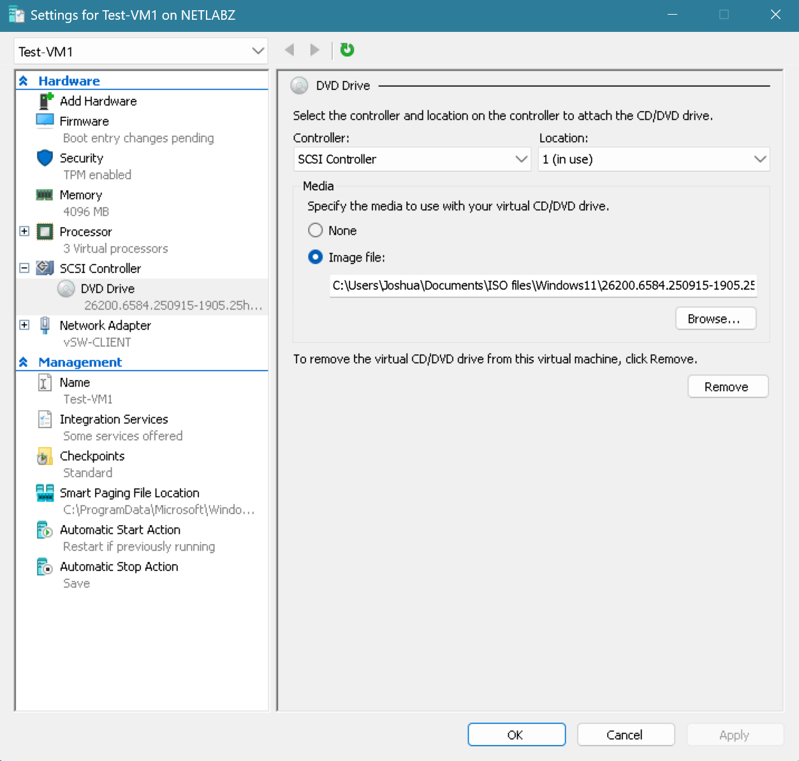
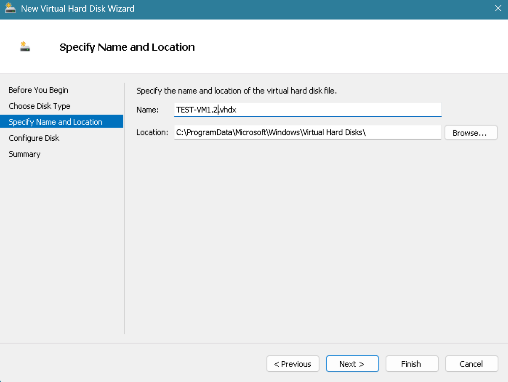
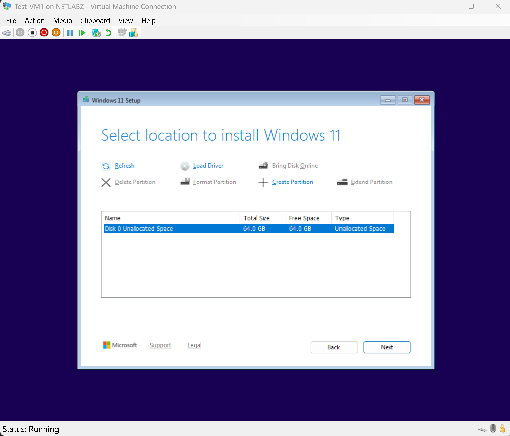

# INC003 - Windows 11 Installation Failed Due to Undersized VHDX

Date: 2026-09-16

Area: Hyper-V / Virtual Storage

## What Happened

While creating `Test-VM1` for virtual switch testing, Windows 11 setup reached the disk selection screen but wouldn't allow the installation to continue.

The only available disk was `Disk 0`, and it had a total capacity of only **4.0 GB** as the intention was to keep it lightweight for testing purposes.

## Root Cause

The virtual hard disk created for the test VM was too small for Windows 11. The VM itself had sufficient memory and CPU resources, but the attached VHDX provided only had 4 GB of storage.

Because the VM had not been configured yet and contained no data that needed to be preserved, I chose to replace the VHDX rather than troubleshoot or resize the existing disk.

## Replacing the Virtual Hard Disk

I had to shut down the VM, open Hyper-V settings, and removed the existing virtual hard disk from the SCSI controller.

I then created a new VHDX for the test VM using the Hyper-V **New Virtual Hard Disk Wizard** and named it 'TEST-VM1.2'.

The replacement virtual disk was configured with **64 GB** of capacity. After attaching the new disk and restarting Windows setup, the installer detected the full 64 GB of unallocated space and allowed the installation to continue.

## What I Learned

This issue reinforced the importance of checking all VM resources during troubleshooting, not just memory and CPU. The Windows 11 installation error initially appeared to be a general setup problem, but reviewing the virtual disk configuration showed that the VHDX was only 4 GB and did not meet the operating system’s storage requirements.

## Evidence

The screenshots above document the original 4 GB disk, removal of the undersized VHDX, creation of the replacement disk, and Windows Setup recognizing the new 64 GB virtual disk.
