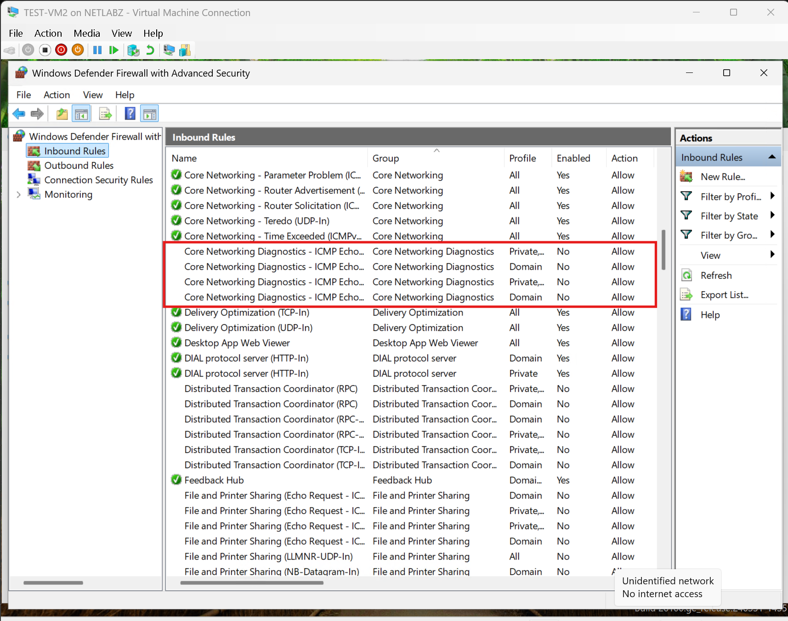
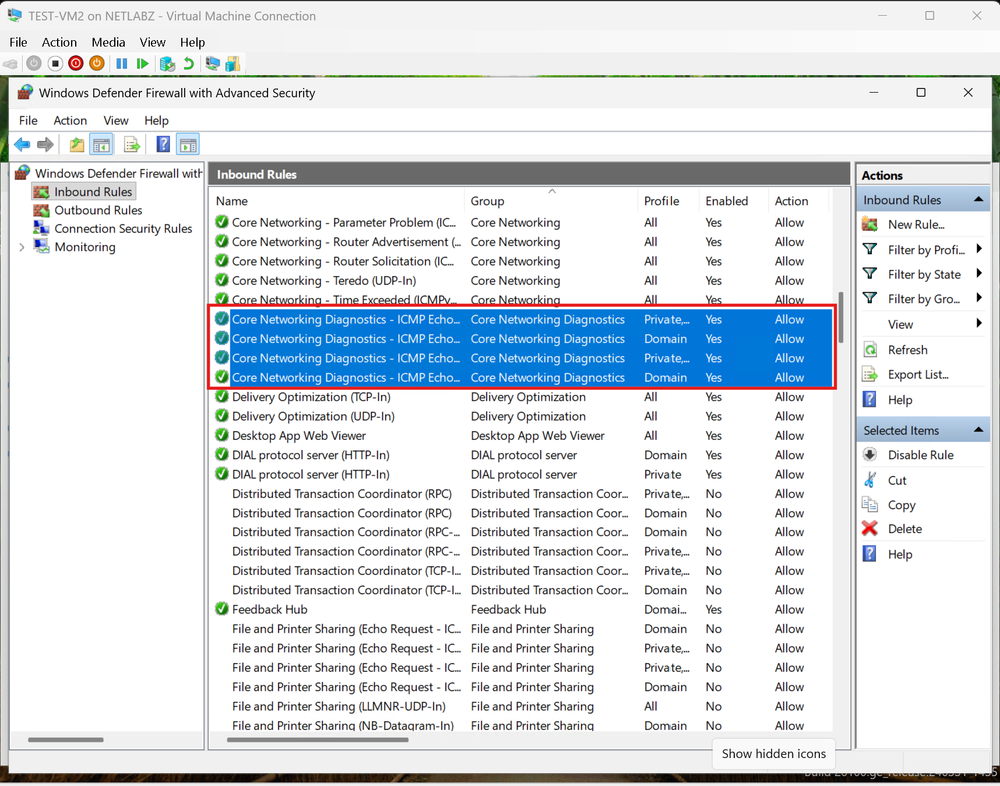

# INC004 - VM-to-VM Ping Blocked by Windows Defender Firewall

Date: 2026-09-16

Area: Hyper-V / Windows Networking / Firewall

## What Happened

While testing communication between two Windows 11 virtual machines connected to `vSW-CLIENT`, I configured both systems with static IPv4 addresses on the same subnet:

- `TEST-VM2` - `10.10.20.2/24`
- `TEST-VM1` - `10.10.20.3/24`

Both VMs were attached to the same Hyper-V internal virtual switch, but a ping from `TEST-VM2` to `10.10.20.3` timed out.

## Identifying the Root Cause

Because both VMs were on the same `10.10.20.0/24` network, they did not need to use the default gateway to communicate with each other. This narrowed the issue to the local host configuration or the virtual switching path rather than the routing.

I checked **Windows Defender Firewall with Advanced Security** on the VM and found that the **Core Networking Diagnostics - ICMP Echo Request** inbound rules were disabled.

The disabled rules prevented the VM from accepting inbound ICMP echo requests even though the IP configuration and Hyper-V switch connection were correct.

## Resolution

I enabled the applicable **Core Networking Diagnostics - ICMP Echo Request** inbound firewall rules in **Windows Defender Firewall with Advanced Security**.

This allowed Windows Firewall to accept ICMP echo requests used by `ping` while keeping the firewall enabled instead of disabling firewall protection entirely.

## What I Learned

A failed ping doesn't automatically mean that the virtual switch, IP addressing, or routing configuration is incorrect. Hosts on the same subnet communicate directly at Layer 2, so the default gateway isn't involved in this test.

This issue reinforced the value of troubleshooting one layer at a time. After verifying that both VMs were connected to the same virtual switch and had valid addresses in the same subnet, checking the endpoint firewall was the next logical step.

I also learned that enabling only the required ICMP inbound rule is better troubleshooting practice than disabling Windows Defender Firewall completely.

## Evidence

The screenshots above document the original ping timeout, the disabled ICMP Echo Request firewall rules identified during troubleshooting, and the firewall rules after they were enabled.
