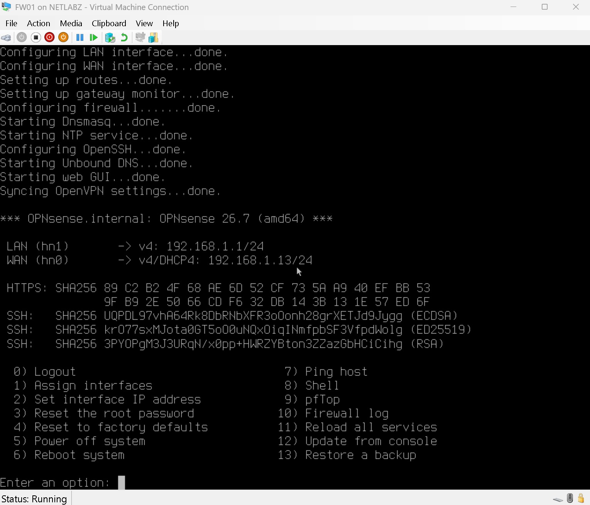

# INC005 - OPNsense WAN Default Gateway Missing

<b>Date: 2026-09-17</b>

<b>Area: Firewall / Routing / OPNsense</b>

## What Happened

After configuring `FW01`, `CLIENT01` could reach the OPNsense LAN interface at `10.10.20.1`, but it could not reach the home gateway or the internet.

Initial testing showed:

- `ping 10.10.20.1` succeeded with 0% packet loss.
- `ping 192.168.1.1` timed out.
- `ping 8.8.8.8` returned `Destination host unreachable` from `10.10.20.1`.
- `nslookup google.com` timed out.
- `tracert 8.8.8.8` stopped at `10.10.20.1`.

Because the client could reach its default gateway but traffic failed immediately at `FW01`, the problem was narrowed down to routing on the firewall rather than the client-side network.

## Identifying the Default Gateway Issue

The OPNsense WAN interface had an IPv4 address on the home network, but it didn't have a usable upstream default gateway. Without a default route, `FW01` had no path for traffic destined outside directly connected networks.

The WAN interface was changed to obtain its IPv4 configuration through DHCP so the home router could provide the WAN address and upstream gateway automatically.
After the change, OPNsense had a valid route toward the home router at `192.168.1.1`.

## Restoring Connectivity

I repeated the same tests from `CLIENT01` after correcting the WAN gateway configuration.

The results were successful:

- `10.10.20.1` responded from the OPNsense LAN interface.
- `192.168.1.1` responded through `FW01`.
- `8.8.8.8` responded with 0% packet loss.
- `nslookup google.com` returned valid DNS records.
- `ping google.com` succeeded.
- `tracert 8.8.8.8` showed the expected first hops through `10.10.20.1` and `192.168.1.1` before continuing through the ISP network.

This confirmed that routing, outbound NAT, and DNS resolution were functioning from the client network.

## What I Learned

A device can have a valid IP address on its WAN interface and still be unable to route traffic if it does not have a valid default gateway. Testing from the client inward helped isolate the problem: reaching `10.10.20.1` proved the LAN side was working, while the failure beyond that point showed the issue was on `FW01`.

The traceroute was especially useful because it showed exactly where traffic stopped before the fix and confirmed the expected path after the gateway was restored.

## Evidence

- `INC005.png` - CLIENT01 reaches `FW01` but cannot reach the home gateway, internet, or DNS.
- `2-firewall-client-communication.png` - CLIENT01 successfully reaches the gateway, internet, DNS, and completes a traceroute after the fix.
